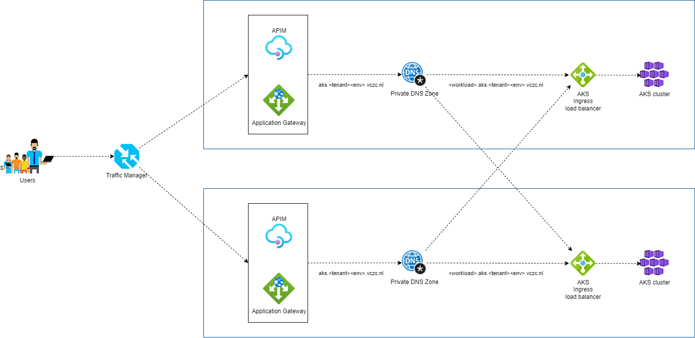
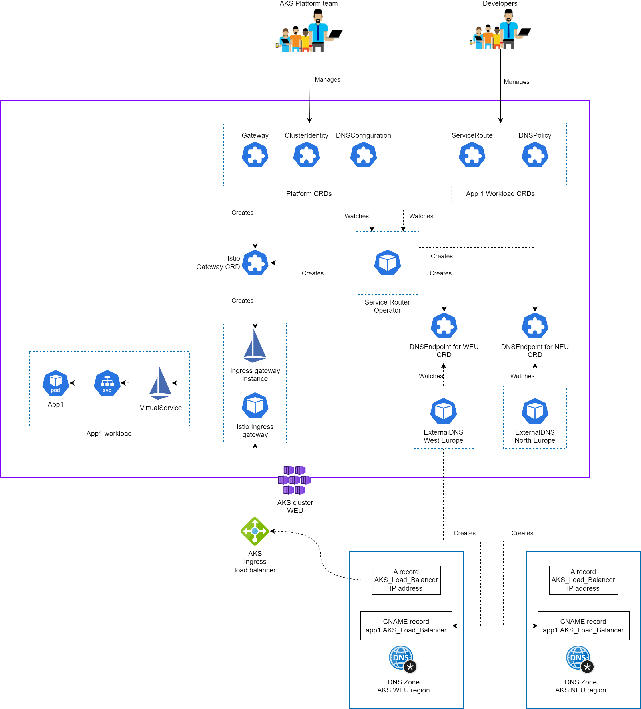
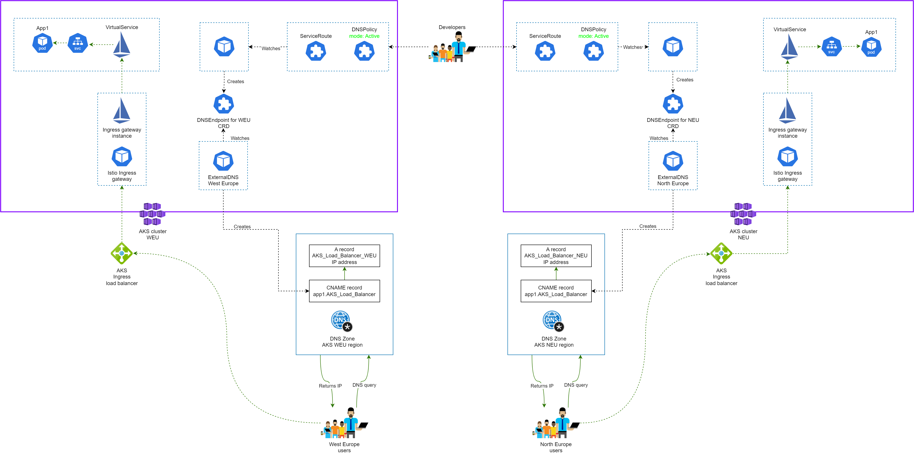
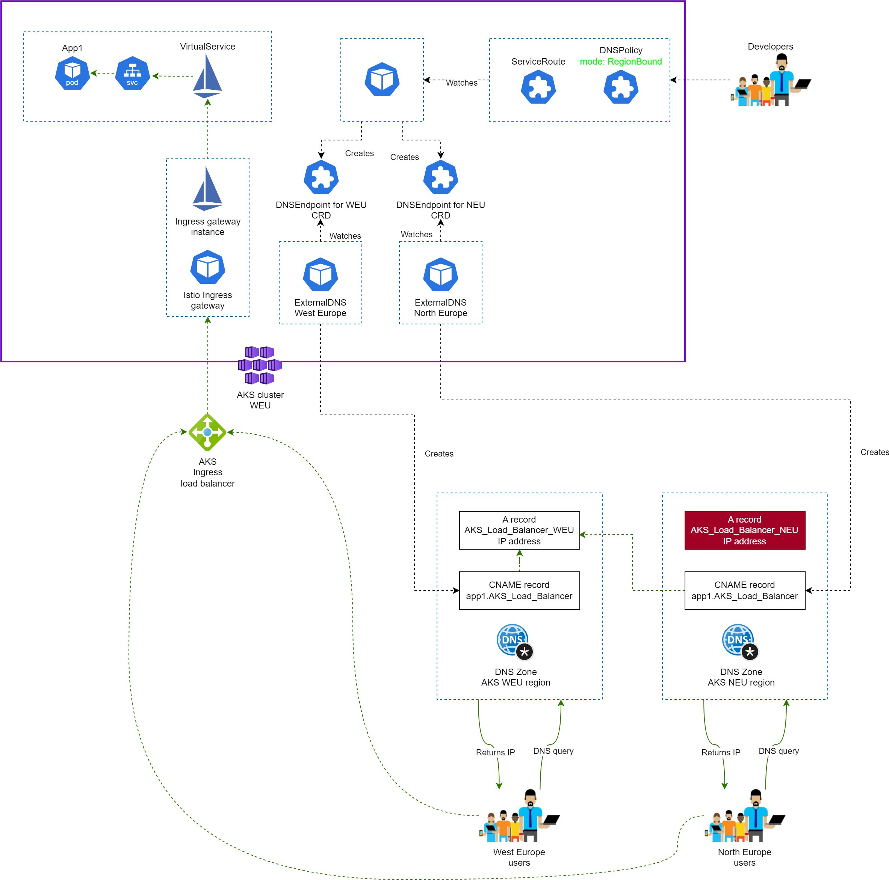

# Introduction

In this post, I walk through the Service Router Operator — a Kubernetes operator I built to automate multi-region DNS provisioning on AKS using Istio and ExternalDNS.

# Multi region DNS on AKS

The AKS platform can operate across multiple Azure regions (in this case West Europe and North Europe) to provide high availability, disaster recovery capabilities and geographic proximity to users.
In this multi-region architecture, a critical requirement is the ability to route traffic seamlessy between regions. When an application or service becomes unavailable in one region, whether due to maintenance, failure, or regional issues, traffic must be automatically or manually redirected to a healthy instance in another region.

Managing DNS across multiple regions presents significant operational complexity: workload teams must route traffic to the correct regional cluster, maintain DNS records across multiple Azure Private DNS zones, and handle both regional isolation and cross-region failover scenarios. **This way DNS management becomes complex and error-prone**

# Service Router Operator

To address these challenges, the Service Router Operator provides automated DNS management for multi-region deployments:
- **Automates DNS Record Creation**: Automatically generates DNS records based on Custom Resources.
- **Enables Regional Control**: Supports both Active (multi-region) and RegionBound (single-region) operational modes.
**Prevents Conflicts**: Uses label-based filtering to ensure each region's ExternalDNS instance only manages its designated DNS records.
**Simplifies Operations**: Workload teams simply declare their services and desired routing behavior using Helm charts.



Our AKS platform spans two Azure regions — North Europe and West Europe — each with its own private DNS zone. When an workload team wants to expose a service, they need DNS records in both zones. The record in the WEU zone should point to the WEU cluster's Istio ingress gateway, and the one in the NEU zone should point to the NEU gateway. Straightforward enough, until you account for:

- **Active-Active services**: the service runs in both regions, each cluster manages its own DNS
- **RegionBound services**: the service only runs in one region, but DNS records still need to exist in all zones pointing to the active cluster
- **Failover scenarios**: if a cluster goes down, another cluster needs to take over DNS management for the failed region.

## Why an Operator?

If you've read my previous post on [KubeBuilder](https://teknologi.nl/posts/kubebuilder/), you'll know I'm a fan of the operator pattern for exactly this kind of problem. An operator runs a continuous reconciliation loop, watching the desired state defined in custom resources and continuously working to make reality match it. For DNS management, this is ideal:

- If a DNS record is manually deleted, the operator recreates it within seconds.
- If a Gateway's LoadBalancer IP changes, the operator updates all CNAME records automatically.
- Workload teams define simple, declarative resources without needing to understand the DNS internals.
- Platform teams retain control over cluster-wide infrastructure through their own set of resources.


## How It Works

The Service Router automates DNS provisioning and traffic routing for services deployed across multiple AKS clusters and regions.

### Components

#### Service Router Operator

The operator manages the lifecycle of DNS records by continuously reconciling Custom Resource Definitions (CRDs) to ensure the desired state matches the actual state.

#### ExternalDNS

ExternalDNS is an AKS platform component that automatically synchronizes Kubernetes networking resources (Services, Ingresses, and DNSEndpoint CRs) with DNS providers like Azure Private DNS zones. It monitors DNSEndpoint custom resources created by the Service Router Operator and provisions the corresponding DNS records.

Key Architecture: Each AKS cluster runs multiple ExternalDNS instances, one for each regional DNS zone. This enables seamless failover when a cluster becomes unavailable, as the healthy cluster's ExternalDNS instance can take over DNS management for the failed region.

#### Label-Based Filtering

The Service Router Operator uses labels to ensure region-specific ExternalDNS instances only manage their designated DNS records. When a DNSEndpoint is created with label app: external-dns-neu, only the NEU ExternalDNS instance processes it and creates records in the NEU Private DNS zone. This ensures:

Prevention of DNS conflicts between regions
Independent region management
Clear ownership and responsibility
Support for both Active and RegionBound operational modes
Important: The Service Router Operator does not directly create DNS records. It creates DNSEndpoint Custom Resources that ExternalDNS watches and uses to provision DNS records in Azure Private DNS.

By combining the Service Router Operator with ExternalDNS and Azure Private DNS, the platform achieves fully automated, conflict-free DNS management that enables seamless traffic routing between regions.

#### Custom Resources

The Service Router Operator defines **five Custom Resource Definitions** across two API groups. Platform teams manage the cluster-wide infrastructure resources, and workload teams manage their own namespace-scoped resources.



```
cluster.router.io/v1alpha1   → ClusterIdentity, DNSConfiguration
routing.router.io/v1alpha1   → Gateway, DNSPolicy, ServiceRoute
```

**ClusterIdentity** (cluster-scoped, platform team): Defines the cluster's metadatam region, cluster name, base domain, and environment letter. This is used to construct DNS names and to determine which ExternalDNS controllers are relevant for this cluster.

**DNSConfiguration** (cluster-scoped, platform team): Lists all ExternalDNS controller instances available across the platform, mapping each controller name to its region. This is the single source of truth for which ExternalDNS controllers exist.

**Gateway** (namespace-scoped, platform team): Wraps an Istio ingress gateway with DNS target information. The operator creates the Istio `Gateway` resource and keeps its `hosts` list synchronized with all `ServiceRoutes` referencing it.

**DNSPolicy** (namespace-scoped, workload team): Defines how DNS records should be propagated for services in that namespace — either in Active mode (this cluster manages its own region only) or RegionBound mode (one cluster manages DNS for multiple regions).

**ServiceRoute** (namespace-scoped, workload team): Links a Kubernetes service to a Gateway and triggers DNS record creation. When you create a `ServiceRoute`, the operator constructs the DNS name and creates the appropriate `DNSEndpoint` resources for ExternalDNS to pick up.

## DNS Provisioning Flow

The operator does **not** create DNS records directly. Instead, it creates `DNSEndpoint` custom resources (from the ExternalDNS CRD API), which ExternalDNS watches and uses to provision records in Azure Private DNS.

```
Workload team creates ServiceRoute
         │
         ▼
Service Router Operator reconciles
  ├── Reads ClusterIdentity (region, domain, cluster)
  ├── Reads DNSPolicy (mode, active controllers)
  ├── Reads Gateway (target postfix, Istio controller)
  └── Creates DNSEndpoint CRDs (one per active ExternalDNS controller)
         │
         ▼
ExternalDNS controller watches DNSEndpoints (filtered by label)
         │
         ▼
ExternalDNS provisions CNAME record in Azure Private DNS:
  api-ns-p-prod-myapp.example.com → aks01-weu-internal.example.com
         │
         ▼
A separate IngressDNS controller (part of the operator) watches
the Gateway's LoadBalancer Service and creates an A record:
  aks01-weu-internal.example.com → 10.123.45.67
```

The two-step CNAME + A record design means that if the gateway IP ever changes (for example, after a cluster recreation), only the A record needs to update — all service CNAME records automatically follow without any changes.

DNS names are constructed deterministically from `ServiceRoute` fields:

```
{serviceName}-ns-{envLetter}-{environment}-{application}.{domain}
```

For example, a `ServiceRoute` with `serviceName: api`, `environment: prod`, `application: myapp` on a cluster with `environmentLetter: p` and `domain: example.com` produces `api-ns-p-prod-myapp.example.com`.

## Operational Modes

The `DNSPolicy` controls how DNS records are spread across regions.

**Active Mode** — use this when your service runs in multiple regions. Each cluster manages DNS only for its own region. A client in WEU queries the WEU DNS zone and routes to the WEU cluster; a client in NEU does the same for its cluster.



**RegionBound Mode** — use this when your service only runs in one region but you still want DNS records in all regional zones. You specify a `sourceRegion`, and only the cluster in that region becomes active. The active cluster creates `DNSEndpoint` resources for all ExternalDNS controllers (WEU and NEU), so both zones get records pointing to the single active cluster. Clusters in other regions are automatically inactive and do not create any DNS records.



| | Active Mode | RegionBound Mode |
|---|---|---|
| **DNS Scope** | Each cluster manages its own region | One cluster manages all regions |
| **Traffic Pattern** | Regional routing (low latency) | Centralized routing (cross-region) |
| **Best For** | High availability, data residency | Single-region services, cost optimization |

### Label-based conflict prevention

To prevent ExternalDNS instances from interfering with each other, the operator sets a `router.io/region` label on every `DNSEndpoint`. Each ExternalDNS deployment is configured with `--label-filter=router.io/region=weu` (or `neu`), so it only processes records intended for it. This ensures WEU ExternalDNS only writes to the WEU DNS zone, and NEU ExternalDNS only writes to the NEU DNS zone — no conflicts, even in complex multi-cluster failover scenarios.

# Implementation

The following guide walks through setting up a test environment on AKS with the Istio addon and External DNS, installing the operator, and deploying a service with automated DNS.

The following steps will be necessary to test the operator:
- [Create an AKS cluster with the Istio addon & Flux extension](#create-an-aks-cluster)
  - The AKS Istio Service Mesh addon provides a managed Istio installation, including the ingress gateway.
  - The AKS Flux extension provides a managed Flux v2 installation. Once enabled, you create a `FluxConfig` that points at the Git repository and individual `Kustomization` resources that sync specific subfolders.
- [Create an Azure Container Registry](#create-acr)
  - An Azure Container Registry is needed to store the operator image before deploying it to AKS.
- [Create an Azure Private DNS Zone](#create-an-azure-private-dns-zone)
- [Configure Workload Identity for ExternalDNS](#configure-workload-identity-for-externaldns)
- [Build and push the operator image](#build-and-push-the-operator-image)
  - The operator image will be pushed to the ACR so that it can be used by the AKS cluster as Kubernetes Operator.
- [Configure GitOps](#configure-gitops)

## Prerequisites

- Azure CLI (`az`) with an active subscription
- `kubectl` and `helm` installed

## Create an AKS Cluster

`--enable-asm` (Istio), `--enable-workload-identity`, and `--enable-oidc-issuer` can all be set at creation time. The Flux extension is a separate Azure resource provider and must be installed in a follow-up command.

```bash
RESOURCE_GROUP="service-router-test-rg"
CLUSTER_NAME="aks-test"
LOCATION="westeurope"

az group create --name $RESOURCE_GROUP --location $LOCATION

az aks create \
  --resource-group $RESOURCE_GROUP \
  --name $CLUSTER_NAME \
  --location $LOCATION \
  --node-count 2 \
  --node-vm-size Standard_D2s_v3 \
  --enable-asm \
  --enable-workload-identity \
  --enable-oidc-issuer \
  --generate-ssh-keys

az aks get-credentials --resource-group $RESOURCE_GROUP --name $CLUSTER_NAME

az aks mesh enable-ingress-gateway \
  --resource-group $RESOURCE_GROUP \
  --name $CLUSTER_NAME \
  --ingress-gateway-type internal

az k8s-extension create \
  --resource-group $RESOURCE_GROUP \
  --cluster-name $CLUSTER_NAME \
  --cluster-type managedClusters \
  --name flux \
  --extension-type microsoft.flux
```

Verify the Istio ingress gateway is running and has an IP address:

```bash
kubectl get svc -n aks-istio-ingress
# NAME                                TYPE           CLUSTER-IP     EXTERNAL-IP    PORT(S)
# aks-istio-ingressgateway-internal   LoadBalancer   10.0.XXX.XXX   10.X.X.X      ...
```

## Create ACR

```bash
ACR_NAME="serviceroutertestacr"  # must be globally unique, alphanumeric only

# Create the registry
az acr create \
  --resource-group $RESOURCE_GROUP \
  --name $ACR_NAME \
  --sku Basic

# Attach the ACR to the AKS cluster so nodes can pull images without extra credentials
az aks update \
  --resource-group $RESOURCE_GROUP \
  --name $CLUSTER_NAME \
  --attach-acr $ACR_NAME
```

## Create an Azure Private DNS Zone

```bash
DNS_ZONE="test-aks.nl"

az network private-dns zone create \
  --resource-group $RESOURCE_GROUP \
  --name $DNS_ZONE

# Link the zone to the AKS VNet
VNET_ID=$(az aks show \
  --resource-group $RESOURCE_GROUP \
  --name $CLUSTER_NAME \
  --query networkProfile.vnetId -o tsv)

az network private-dns link vnet create \
  --resource-group $DNS_RESOURCE_GROUP \
  --zone-name $DNS_ZONE \
  --name aks-vnet-link \
  --virtual-network $VNET_ID \
  --registration-enabled false
```

## Configure Workload Identity for ExternalDNS

ExternalDNS needs a managed identity with permissions to write to the DNS zone. With AKS Workload Identity this is straightforward.

```bash
# Get the AKS OIDC issuer
OIDC_ISSUER=$(az aks show \
  --resource-group $RESOURCE_GROUP \
  --name $CLUSTER_NAME \
  --query oidcIssuerProfile.issuerUrl -o tsv)

SUBSCRIPTION_ID=$(az account show --query id -o tsv)
DNS_ZONE_ID="/subscriptions/$SUBSCRIPTION_ID/resourceGroups/$RESOURCE_GROUP/providers/Microsoft.Network/privateDnsZones/$DNS_ZONE"

# Create managed identity for ExternalDNS
az identity create \
  --resource-group $RESOURCE_GROUP \
  --name "id-external-dns-weu"

CLIENT_ID=$(az identity show \
  --resource-group $RESOURCE_GROUP \
  --name "id-external-dns-weu" \
  --query clientId -o tsv)

# Grant DNS Zone Contributor on the private DNS zone
az role assignment create \
  --assignee $CLIENT_ID \
  --role "Private DNS Zone Contributor" \
  --scope $DNS_ZONE_ID

# Create federated credential for Workload Identity
az identity federated-credential create \
  --name external-dns-weu \
  --identity-name id-external-dns-weu \
  --resource-group $RESOURCE_GROUP \
  --issuer $OIDC_ISSUER \
  --subject "system:serviceaccount:external-dns:external-dns-weu"
```

## Build and push the operator image

```bash
az acr build \
  --registry $ACR_NAME \
  --image service-router-operator:latest \
  --file Dockerfile .

# Verify the image is available in the registry:

az acr repository show-tags \
  --name $ACR_NAME \
  --repository service-router-operator \
  --output table
```

## Configure GitOps

```bash
az k8s-configuration flux create \
  --resource-group $RESOURCE_GROUP \
  --cluster-name $CLUSTER_NAME \
  --cluster-type managedClusters \
  --name service-router \
  --namespace flux-system \
  --url https://github.com/AshwinSarimin/service-router-operator \
  --branch main \
  --kustomization name=crds \
      path=config/crd/bases \
      prune=true \
      wait=true \
  --kustomization name=operator \
      path=config/overlays/production \
      prune=true \
      wait=true \
      depends-on=crds
```

The `--kustomization` flags create two `Kustomization` resources in the `flux-system` namespace:

| Name | Path | Purpose |
|---|---|---|
| `crds` | `config/crd/bases` | Installs the five CRDs before anything else |
| `operator` | `config/overlays/production` | Deploys the operator with production patches; depends on `crds` |

### Verify sync status

```bash
# Check the GitRepository source is ready
kubectl get gitrepository -n flux-system service-router

# Check both Kustomizations are reconciled
kubectl get kustomization -n flux-system
# NAME       READY   STATUS                      AGE
# crds       True    Applied revision: main/...  1m
# operator   True    Applied revision: main/...  1m
```

Flux reconciles every 10 minutes by default. To force an immediate sync:

```bash
az k8s-configuration flux update \
  --resource-group $RESOURCE_GROUP \
  --cluster-name $CLUSTER_NAME \
  --cluster-type managedClusters \
  --name service-router
```

## Install ExternalDNS via Helm

```bash
helm repo add external-dns https://kubernetes-sigs.github.io/external-dns/
helm repo update

kubectl create namespace external-dns

# Create service account with Workload Identity annotation
kubectl apply -f - <<EOF
apiVersion: v1
kind: ServiceAccount
metadata:
  name: external-dns-weu
  namespace: external-dns
  annotations:
    azure.workload.identity/client-id: "$CLIENT_ID"
EOF

helm install external-dns-weu external-dns/external-dns \
  --namespace external-dns \
  --set provider.name=azure-private-dns \
  --set "extraArgs[0]=--source=crd" \
  --set "extraArgs[1]=--crd-source-apiversion=externaldns.k8s.io/v1alpha1" \
  --set "extraArgs[2]=--crd-source-kind=DNSEndpoint" \
  --set "extraArgs[3]=--txt-owner-id=external-dns-weu" \
  --set "extraArgs[4]=--label-filter=router.io/region=weu" \
  --set "extraArgs[5]=--azure-resource-group=$RESOURCE_GROUP" \
  --set "extraArgs[6]=--azure-subscription-id=$SUBSCRIPTION_ID" \
  --set "extraArgs[7]=--domain-filter=$DNS_ZONE" \
  --set "extraArgs[8]=--policy=upsert-only" \
  --set serviceAccount.create=false \
  --set serviceAccount.name=external-dns-weu \
  --set "podLabels.azure\\.workload\\.identity/use=true"
```

## Install the Service Router Operator and CRDs

```bash
# Clone the repository
git clone https://github.com/AshwinSarimin/service-router-operator.git
cd service-router-operator

# Install the 5 CRDs
kubectl apply -f config/crd/bases/

# Verify CRDs are installed
kubectl get crds | grep router.io
# clusteridentities.cluster.router.io
# dnsconfigurations.cluster.router.io
# gateways.routing.router.io
# dnspolicies.routing.router.io
# serviceroutes.routing.router.io

# Install the operator
kubectl apply -k config/default

# Verify operator is running
kubectl get pods -n service-router-system
```

## Step 5: Configure the Cluster

Platform teams configure the cluster-scoped resources. This is typically done once during cluster setup and managed with Flux or ArgoCD.

```bash
# 1. ClusterIdentity - tells the operator about this cluster
kubectl apply -f - <<EOF
apiVersion: cluster.router.io/v1alpha1
kind: ClusterIdentity
metadata:
  name: cluster-identity
spec:
  region: weu
  cluster: aks01
  domain: example-test.private
  environmentLetter: p
EOF

# 2. DNSConfiguration - defines which ExternalDNS controllers exist
kubectl apply -f - <<EOF
apiVersion: cluster.router.io/v1alpha1
kind: DNSConfiguration
metadata:
  name: dns-config
spec:
  externalDNSControllers:
    - name: external-dns-weu
      region: weu
EOF

# 3. Gateway - wraps the AKS Istio ingress gateway
kubectl apply -f - <<EOF
apiVersion: routing.router.io/v1alpha1
kind: Gateway
metadata:
  name: default-gateway
  namespace: aks-istio-ingress
spec:
  controller: aks-istio-ingressgateway-external
  credentialName: ""     # omit for test (no TLS)
  targetPostfix: external
EOF
```

## Step 6: Deploy a Service with Automated DNS

workload teams create two resources in their namespace: a `DNSPolicy` and a `ServiceRoute`. Here I'll use a simple echo server to test the end-to-end flow.

```bash
kubectl create namespace myapp

# Deploy a test application
kubectl apply -f - <<EOF
apiVersion: apps/v1
kind: Deployment
metadata:
  name: echo
  namespace: myapp
spec:
  replicas: 1
  selector:
    matchLabels:
      app: echo
  template:
    metadata:
      labels:
        app: echo
    spec:
      containers:
        - name: echo
          image: ealen/echo-server:latest
          ports:
            - containerPort: 80
---
apiVersion: v1
kind: Service
metadata:
  name: echo
  namespace: myapp
spec:
  selector:
    app: echo
  ports:
    - port: 80
      targetPort: 80
EOF

# DNSPolicy - Active mode: this cluster manages DNS for its own region
kubectl apply -f - <<EOF
apiVersion: routing.router.io/v1alpha1
kind: DNSPolicy
metadata:
  name: myapp-dns
  namespace: myapp
spec:
  mode: Active
EOF

# ServiceRoute - links the echo service to the gateway
kubectl apply -f - <<EOF
apiVersion: routing.router.io/v1alpha1
kind: ServiceRoute
metadata:
  name: echo-route
  namespace: myapp
spec:
  serviceName: echo
  gatewayName: default-gateway
  gatewayNamespace: aks-istio-ingress
  environment: test
  application: myapp
EOF

# VirtualService - route traffic from the gateway to the service
# Note: the operator adds the hostname to the Gateway, but you create the VirtualService
kubectl apply -f - <<EOF
apiVersion: networking.istio.io/v1beta1
kind: VirtualService
metadata:
  name: echo-route
  namespace: myapp
spec:
  hosts:
    - echo-ns-p-test-myapp.example-test.private
  gateways:
    - aks-istio-ingress/default-gateway
  http:
    - route:
        - destination:
            host: echo.myapp.svc.cluster.local
            port:
              number: 80
EOF
```

## Step 7: Verify

```bash
# Check ServiceRoute status
kubectl get serviceroute -n myapp echo-route -o yaml | grep -A 10 status

# Check that the operator created DNSEndpoint resources
kubectl get dnsendpoints -n myapp
# NAME                                  AGE
# echo-route-external-dns-weu           30s

# Check what the DNSEndpoint contains
kubectl get dnsendpoint -n myapp echo-route-external-dns-weu -o yaml

# Check ExternalDNS picked it up
kubectl logs -n external-dns -l app.kubernetes.io/name=external-dns --tail=20
# time="..." level=info msg="Desired change: CREATE echo-ns-p-test-myapp.example-test.private CNAME"

# Verify DNS record in Azure
az network private-dns record-set cname show \
  --resource-group $DNS_RESOURCE_GROUP \
  --zone-name $DNS_ZONE \
  --name echo-ns-p-test-myapp
```

Within about a minute, you should see the CNAME record in Azure Private DNS pointing to the Istio ingress gateway hostname, and the A record for the gateway hostname pointing to the LoadBalancer IP. Traffic from within the VNet to `echo-ns-p-test-myapp.example-test.private` will now route through Istio to the echo service.

---

# What I learned building this

Building the Service Router Operator reinforced a few things about the operator pattern in practice.

**Self-healing is the killer feature.** We've had situations where DNS records were accidentally deleted from Azure Private DNS — with the operator, they were recreated within 60 seconds without any manual intervention. With the Helm approach, someone would need to manually run `helm upgrade` to restore them.

**CRD design matters a lot.** The split between cluster-scoped CRDs (ClusterIdentity, DNSConfiguration) and namespace-scoped CRDs (Gateway, DNSPolicy, ServiceRoute) reflects the real team boundaries on our platform. Platform engineers manage the cluster-wide infrastructure; workload teams manage their own namespaces. The RBAC model follows naturally from this design.

**ExternalDNS ownership model is powerful but subtle.** The `--txt-owner-id` pattern is what enables seamless cross-cluster DNS takeover within the same region. Two clusters in the same region share the same owner ID for their ExternalDNS instances, which means either cluster can take over DNS management from the other without conflicts.

# Repository and Documentation

The operator is open source and available on GitHub. The repository includes Helm charts for deployment, sample CRDs, and documentation:

- [GitHub Repository](https://github.com/AshwinSarimin/service-router-operator)
- [Architecture](docs/ARCHITECTURE.md) — CRD relationships, DNS flow, multi-region behavior
- [User Guide](docs/USER-GUIDE.md) — Using ServiceRoute, DNSPolicy, and Gateway CRDs  
- [ExternalDNS Integration](docs/EXTERNALDNS-INTEGRATION.md) — Ownership model, cross-cluster takeover
- [Installation](docs/INSTALLATION.md) — Deployment on AKS and local development

## Requirements

- Kubernetes 1.24+
- Istio 1.18+ (or AKS Istio Service Mesh addon)
- ExternalDNS 0.13+ (configured with `--source=crd`)
- Azure Private DNS (or other supported provider)

## License

Apache License 2.0
