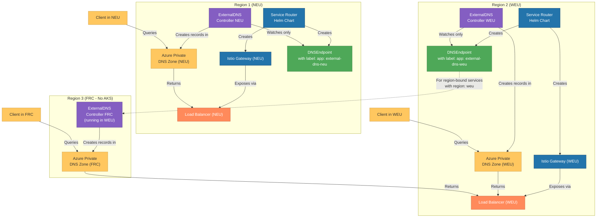
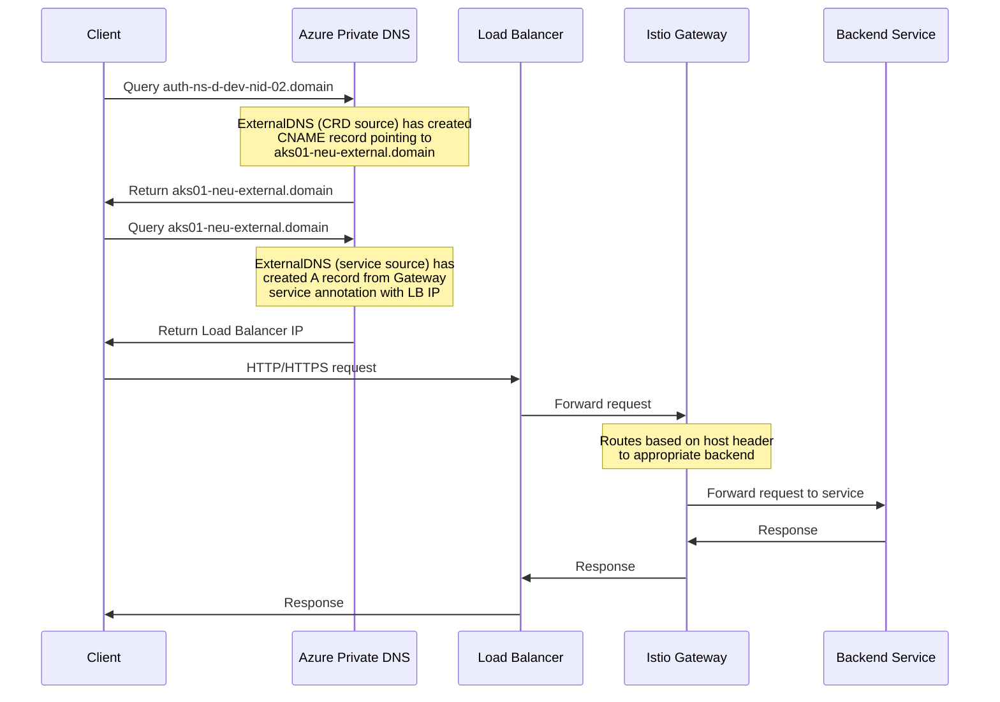
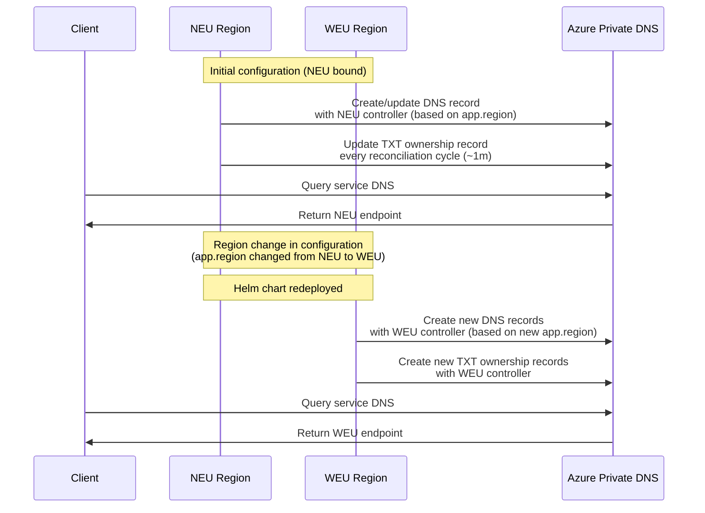
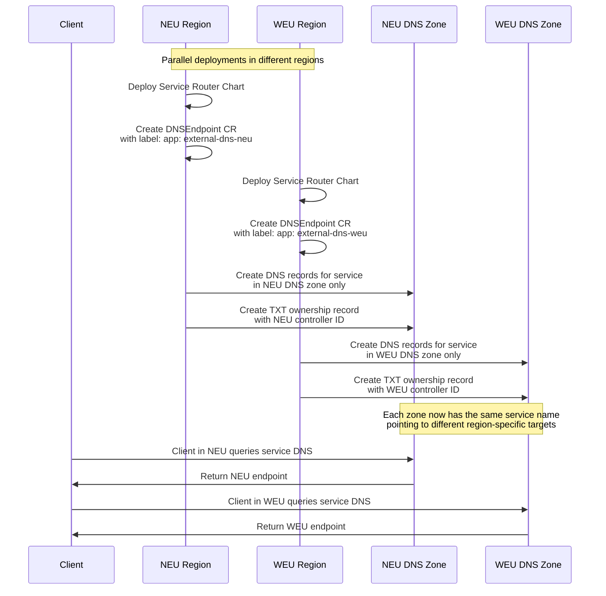
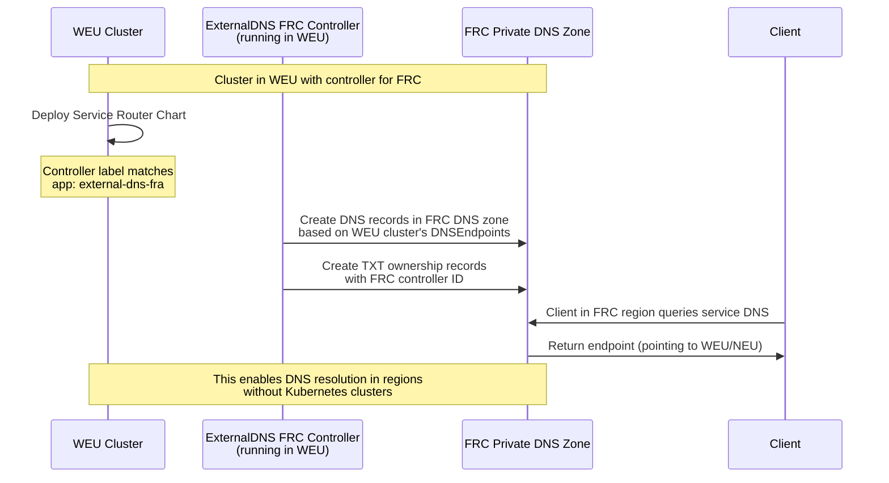

# Multi-Region Service Router

> **TL;DR**: This Helm chart manages DNS records and Istio Gateways for multi-cluster, multi-region Kubernetes deployments. It supports both "active" mode (each cluster manages its own DNS records) and "region-bound" mode (services are explicitly assigned to specific regions).

This Helm chart manages two critical components for multi-cluster, multi-region Kubernetes deployments:

1. **DNS Endpoints** – Creates DNSEndpoint Custom Resources for ExternalDNS to manage DNS records
2. **Istio Gateways** – Configures Istio Gateway resources for traffic management

## Overview

The chart creates DNS entries for services that follow a standardized naming pattern and routes them through appropriate gateways. It supports:

- Multiple region deployments
- Active/standby service routing
- Region-bound services
- Multiple gateway types with different target hosts

## Architecture Diagram



## Component Workflow

1. **Multi-Region Service Router Chart** deploys:

   - **Istio Gateways** for traffic routing (one per gateway type)
   - **DNSEndpoint CRs** for service DNS record management with region-specific controller labels

2. **Gateway Service** has annotations:

   - `external-dns.alpha.kubernetes.io/hostname: "${CLUSTER}-${REGION}-external.aks.${TENANT}${ENV_LETTER}.vczc.nl"`
   - This service is exposed via Load Balancer and gets an IP address
   - ExternalDNS processes this service via its "service" source and creates an A record with the Load Balancer IP

3. **DNSEndpoint CRs** specify:

   - Source host: `{service-name}-ns-{env-letter}-{env-name}-{app-name}.{domain}`
   - Target host: `{cluster}-{region}-{gateway-target-postfix}.{domain}` (matching the gateway service annotation)
   - Controller label: `app: external-dns-{region}`

4. **Region-Specific ExternalDNS Controllers**:

   - Each region has a dedicated ExternalDNS controller (e.g., `external-dns-neu`, `external-dns-weu`)
   - Each controller only watches DNSEndpoint CRs with its matching controller label
   - Each controller manages records in its region's Azure Private DNS zone
   - When a controller observes a DNSEndpoint CR with its matching label:
     - It creates DNS records in Azure Private DNS pointing to the gateway service targets
     - It adds TXT records for ownership tracking with the format: `{txtPrefix}{dnsHostname}`

5. **Multi-Region DNS Management**:

   - When `mode: active`, only the controller in the same region as the cluster processes the DNSEndpoint
     - The same service will have DNS records in each region where the chart is deployed
     - Each record is managed by its respective region's controller
   - When `mode: regionbound`, only the controller in the same region as specified in the app's `region` property processes the DNSEndpoint
     - Only one region will have DNS records for the service, regardless of where the chart is deployed
     - These records are managed only by the controller in the specified region
   - This enables clear region-specific routing for services based on configuration

6. **Traffic Flow**:

   - Client requests `service-name.domain` → Azure Private DNS → Gateway IP → Istio Gateway → Service

### Traffic Flow Diagram



## Region-Based Behavior

### Region Modes

- **Active Mode**:

  - Records are only created by DNS controllers in the same region as the cluster
  - Each cluster creates DNSEndpoints with the controller label matching its own region
  - Each controller only writes records to its own region's private DNS zone
  - The same service name will have different DNS records in each zone, pointing to each region's gateway
  - To change which region handles a service, you must deploy to a cluster in the desired region
  - Typically used for services that should be available in all regions where the chart is deployed

- **Region-bound Mode**:

  - Records are only created by DNS controllers in the same region specifically defined in the app's `region` property
  - This mode is used for services that should only be available in a specific region
  - Each region has its own ExternalDNS controller that manages records for its bound services
  - Changing the `region` property triggers an immediate controller reassignment
  - This provides explicit control over which region handles each service
  - This is the only mechanism for reassigning services to different regions without redeploying to a different cluster

- **Cross-Region Controller Management**:

  - Some regions may have a private DNS zone but no Kubernetes cluster (e.g., FRC region)
  - In this case, controllers running in one region (e.g., WEU) can be configured to manage DNS records in another region's DNS zone
  - This is achieved by setting the controller's `region` property to match an active region, while the controller name identifies the target DNS zone
  - Example: A controller named `external-dns-fra` with `region: weu` will process DNSEndpoints from WEU but write records to the FRA DNS zone
  - This approach ensures DNS resolution works consistently across your entire environment, even in regions without AKS clusters
  - For detailed configuration instructions, see [Cross-Region Controller Configuration](#cross-region-controller-configuration)

### Region-Bound Mode Diagram



### Active Mode Diagram

In Active Mode, each cluster manages DNS records for its own region. This means that when you deploy the same chart to multiple clusters (in different regions), each cluster will only create records in its own region's DNS zone.



With Active Mode:

1. **Region-specific DNSEndpoints**:
   - The chart in NEU cluster creates DNSEndpoints with `controller: external-dns-neu`
   - The chart in WEU cluster creates DNSEndpoints with `controller: external-dns-weu`

2. **Zone Isolation**:
   - NEU controller only writes to the NEU DNS zone
   - WEU controller only writes to the WEU DNS zone

3. **Same Service Names, Different Targets**:
   - The same service name (e.g., `auth-ns-d-dev-nid-02.domain`) resolves to different targets in each region
   - In NEU: points to `aks01-neu-external.domain`
   - In WEU: points to `aks01-weu-external.domain`

4. **No Cross-Region Management**:
   - Controllers only manage DNSEndpoints in their own region
   - Unlike Region-bound mode, you cannot change which controller manages a record without deploying to a different cluster

### Cross-Region Controller Diagram



This cross-region controller setup is especially useful for:

1. **Regional Compliance**: When services must appear to be accessible from specific regions for regulatory reasons
2. **Traffic Routing**: Ensuring users in every region can access services, even if those regions don't host Kubernetes clusters
3. **Disaster Recovery**: Maintaining DNS resolution capabilities even if a region's Kubernetes infrastructure is unavailable
4. **Cost Optimization**: Avoiding the need to deploy Kubernetes clusters in every region that needs DNS resolution

### TXT Record Ownership Mechanism

ExternalDNS uses TXT records to track ownership of DNS records. This ownership mechanism helps maintain clear boundaries between controllers in different regions. Here's how it works:

1. **TXT Record Creation**: When ExternalDNS creates a DNS record, it also creates a corresponding TXT record with information about the owner.
   - Format: `"heritage=external-dns,external-dns/owner={txtOwnerId},external-dns/resource="{dnsRecordName}"`
   - Example: `"heritage=external-dns,external-dns/owner=external-dns-neu,external-dns/resource=auth-ns-d-dev-nid-02.aks.vecd.vczc.nl"`

2. **Ownership Refresh**: The controller that owns a DNS record periodically updates its TXT record:
   - Each ExternalDNS controller refreshes the TXT records it owns during every reconciliation cycle
   - Default reconciliation interval: Every 1 minute (controlled by the `--interval` flag)
   - This ensures the records stay current and properly managed

3. **Controller-Specific Management**:
   - ExternalDNS controllers only manage records that match their controller label
   - For the multi-region service router, this means the controller label on the DNSEndpoint resource must match
   - Example: `app: external-dns-neu`
   - This label is set to the controller name from the `externalDns` section in values.yaml
   - Each controller will only process DNSEndpoint resources with its matching controller label

4. **Region Changes**:
   - When a service's region property changes in the chart configuration, the record appears in a different DNSEndpoint
   - This immediately redirects management of the record to the controller in the newly specified region
   - No time-based ownership transfer occurs; it's an immediate change based on the region filtering logic

5. **No Race Conditions**: The ownership model prevents multiple controllers from simultaneously managing the same DNS record:
   - Each controller only manages records with its specific controller label
   - The `--txt-prefix` setting ensures unique TXT record names per host

This mechanism ensures that:

- Only controllers with matching labels manage corresponding DNS records
- DNS records always point to the region specified in the app configuration
- Clear separation of responsibilities between regional controllers

This multi-controller approach enables:

1. Service availability across multiple regions
2. Automatic failover between regions
3. Region-specific service deployment
4. Independent management of DNS zones per region

### Record Filtering Logic

The multi-region service router uses the operational mode to determine which records should appear in which DNSEndpoint resources:

- In **Active Mode**: Records are only included in DNSEndpoints for controllers in the cluster's current region

  ```yaml
  {{- if eq $appMode "active" }}
    {{- if eq $region $controllerRegion }}
      {{- $shouldCreateRecord = true }}
    {{- end }}
  {{- end }}
  ```

- In **Region-bound Mode**: Records are only included in DNSEndpoints for controllers in the app's specified region

  ```yaml
  {{- if eq $appMode "regionbound" }}
    {{- if eq $appRegion $controllerRegion }}
      {{- $shouldCreateRecord = true }}
    {{- end }}
  {{- end }}
  ```

- For **Cross-Region Controllers**: The controller name identifies the target DNS zone, while its configured region value determines which records it processes. For example, a controller named `external-dns-fra` with `region: weu` would:
  - Process DNSEndpoints in active mode from clusters in WEU region
  - Process DNSEndpoints in region-bound mode with `region: weu`
  - But write the resulting DNS records to the FRA DNS zone

When a region change occurs (by changing the app's `region` property), the records are filtered differently on the next chart deployment, immediately changing which controller processes them.

## ExternalDNS Integration

This chart creates `DNSEndpoint` Custom Resources that are consumed by the ExternalDNS controller to create DNS records in Azure Private DNS.

### ExternalDNS Configuration

The chart is designed to work with the ExternalDNS configuration found in `/infrastructure/controllers/external-dns/`. Key aspects of the ExternalDNS setup include:

1. **Region-specific Controllers and DNS Zones**:
   - Each region has its own ExternalDNS controller (e.g., `external-dns-neu`, `external-dns-weu`)
   - Each controller is configured to access its region-specific Azure Private DNS zone
   - Controllers are deployed in each cluster to handle region-specific DNS records

2. **TXT Record Ownership**: ExternalDNS uses TXT records to track ownership using the `txtOwnerId` and `txtPrefix` settings:
   - Each controller has a unique `txtOwnerId` (e.g., "external-dns-neu")
   - The `txtPrefix` is set to `"${REGION}-${ENV_LETTER}-${CLUSTER}-"` to avoid conflicts

3. **Controller Label**: DNSEndpoint resources specify which controller should manage their DNS records using the `app` label:

   ```yaml
   app: external-dns-[region]
   ```

4. **Azure Private DNS Integration**: ExternalDNS is configured to use the Azure Private DNS provider with these key settings:

   ```yaml
   provider: azure-private-dns
   domainFilters: ["aks.${TENANT}${ENV_LETTER}.vczc.nl"]
   ```

5. **Managed Record Types**: The controllers manage both A and CNAME records:

   ```yaml
   - "--managed-record-types=CNAME"
   - "--managed-record-types=A"
   ```

6. **CRD Source Configuration**: ExternalDNS is configured to watch for DNSEndpoint CRDs:

   ```yaml
   - "--crd-source-apiversion=externaldns.k8s.io/v1alpha1"
   - "--crd-source-kind=DNSEndpoint"
   ```

### Gateway Service DNS Configuration

The target hostnames used for DNS records are defined in the Istio Gateway services using the `external-dns.alpha.kubernetes.io/hostname` annotation. This is configured in:

```yaml
# File: infrastructure/configs/istio-ingress/gateway-services/aks-istio-ingressgateway-internal-service.yaml
apiVersion: v1
kind: Service
metadata:
  name: aks-istio-ingressgateway-internal
  annotations:
    service.beta.kubernetes.io/azure-load-balancer-internal-subnet: "${TENANT}-app-${REGION}-${ENV_LETTER}-aks-lb-sn"
    external-dns.alpha.kubernetes.io/hostname: "${CLUSTER}-${REGION}-external.aks.${TENANT}${ENV_LETTER}.vczc.nl"
    # other annotations...
```

This annotation defines the target DNS name for the gateway's load balancer. The parameters in the target name are replaced with actual values during deployment, resulting in names like `aks01-neu-external.aks.vecd.vczc.nl`.

#### A Record Resolution

ExternalDNS resolves these gateway hostnames to A records through two mechanisms:

1. **Service Source Processing**: ExternalDNS is configured with the `--service-type-filter=LoadBalancer` argument and includes `service` in its source list:

   ```yaml
   sources:
   - "service"
   - "crd"
   ```

   When ExternalDNS detects the `external-dns.alpha.kubernetes.io/hostname` annotation on the gateway's LoadBalancer Service, it:

   - Creates an A record pointing to the Load Balancer's IP address
   - Uses the hostname specified in the annotation as the DNS record name
   - Records are maintained in the Private DNS Zone for the region

2. **DNSEndpoint Integration**: The chart creates DNSEndpoints that use CNAME records pointing to these gateway hostnames:

   - Service DNS: `auth-ns-d-dev-nid-02.aks.vecd.vczc.nl` (CNAME)
   - Target: `aks01-neu-external.aks.vecd.vczc.nl` (A record, created from service annotation)

This dual mechanism enables the complete DNS resolution path from service name to actual load balancer IP address.

### Key ExternalDNS Options

To ensure proper integration with this chart, your ExternalDNS controllers should include:

- **CRD Source**: Enable the CRD source to read DNSEndpoint resources
- **Region-specific Ownership**: Use unique `txtOwnerId` values for each regional controller
- **Azure Credentials**: Configure access to Azure Private DNS (via MSI or Workload Identity)
- **Domain Filtering**: Restrict DNS management to your specific domain
- **Record Syncing Policy**: Use `--policy=sync` to ensure controllers clean up stale records they own

The ExternalDNS configuration in this environment includes these important settings:

```yaml
# From base/release.yaml
txtPrefix: "${REGION}-${ENV_LETTER}-${CLUSTER}-"    # Makes TXT records unique
provider: azure-private-dns                         # Uses Azure Private DNS zones
extraArgs:                                          # Important CLI flags
  - "--crd-source-apiversion=externaldns.k8s.io/v1alpha1"  # DNSEndpoint API version
  - "--crd-source-kind=DNSEndpoint"                 # Watch DNSEndpoint CRDs
  - "--managed-record-types=CNAME"                  # Manage both CNAME records
  - "--managed-record-types=A"                      # and A records
  # Default (not explicitly set):
  # --txt-owner-id="external-dns-neu"               # Owner ID used in TXT records
  # --txt-prefix="region-env-cluster-"              # Prefix for TXT record names
  # --interval=1m                                   # Reconciliation interval
  # --policy=sync                                   # Clean up records no longer in source

# From region-specific values.yaml
txtOwnerId: "external-dns-neu"                      # Unique ownership ID per controller
```

### Record Ownership Timing

The record ownership and failover timing in ExternalDNS is controlled by these key flags:

| Flag | Default | Description |
|------|---------|-------------|
| `--interval` | 1m | How often the controller reconciles records |
| `--txt-owner-id` | "default" | The ID that identifies this ExternalDNS instance in TXT records |
| `--txt-prefix` | "" | A prefix used for TXT record names to avoid conflicts |
| `--policy` | "upsert-only" | Record management policy ("sync" removes stale records, "upsert-only" only adds/updates) |

With these settings, when a region change is made via configuration update, it takes effect immediately upon chart redeployment. There is no automatic failover; changes must be explicitly made by updating the chart configuration.

## Cross-Region Controller Configuration

Building on the concepts described in [Region Modes](#region-modes) earlier, the multi-region service router supports scenarios where a region has a private DNS zone but no Kubernetes cluster. In this case, you can configure controllers running in one region to manage DNS records in another region's DNS zone.

For example, if you have a private DNS zone in the FRC (France Central) region but no Kubernetes cluster there, you can:

1. Deploy an ExternalDNS controller in another region (e.g., WEU)
2. Configure this controller to manage records in the FRC private DNS zone
3. Add this controller configuration to the `externalDns` section in the chart values:

```yaml
externalDns:
  - controller: external-dns-neu
    region: neu
  - controller: external-dns-weu
    region: weu
  - controller: external-dns-fra
    region: weu  # Controller named 'external-dns-fra' with region set to 'weu'
```

In this example:

- The `external-dns-fra` controller is responsible for the FRC region's DNS zone
- But it's configured with `region: weu`, meaning:
  - It will only process DNSEndpoints created by clusters in the WEU region
  - Or DNSEndpoints with `regionbound` mode and `region: weu` property
  - But it will write the resulting DNS records to the FRC DNS zone

This configuration creates a mapping between the controller name (which identifies the target DNS zone) and the region value (which identifies where DNSEndpoints are processed from).

This approach lets you provision DNS records in regions without Kubernetes clusters, ensuring consistent DNS resolution across your entire environment, even in regions that only have other Azure resources but no AKS clusters.

## Region Management

The chart's region-aware controller labels ensure that DNS records are managed by the correct regional controller:

1. Each DNSEndpoint has a specific controller label (`app: external-dns-{region}`)
2. Only the controller with the matching label will manage that DNSEndpoint
3. To change which region manages a service, update the app's `region` property and redeploy the chart

This approach provides explicit control over which region handles each service's DNS records. There is no automatic failover between regions; region changes require manual configuration updates.

For more detailed information on configuring ExternalDNS, refer to the configuration in `/infrastructure/controllers/external-dns/`.

## Configuration Reference

This section provides a reference for the various configuration options available in the multi-region-service-router chart.

### Global Settings

```yaml
cluster: "aks01"                   # Current cluster name
region: "neu"                      # Current region code
environmentLetter: "d"             # Environment letter (d=dev, t=test, p=prod)
domain: "aks.vecd.vczc.nl"         # Base domain for DNS records
```

### External DNS Controllers

Configure ExternalDNS controllers that should create DNS records:

```yaml
externalDns:
  - controller: external-dns-neu   # ExternalDNS controller name
    region: neu                    # Region this controller is responsible for
  - controller: external-dns-weu
    region: weu
  - controller: external-dns-fra
    region: weu  # Controller named 'external-dns-fra' with region set to 'weu'
```

### Gateways

Define Istio gateways that services can route through:

```yaml
gateways:
  - name: "default-gateway-ingress"      # Gateway name (referenced by services)
    controller: "aks-istio-ingressgateway-internal"  # Istio gateway implementation
    credentialName: "cert-aks-ingress"   # TLS certificate secret
    targetPostfix: "external"            # Postfix used in target hostname
  - name: "internal-gateway-ingress" 
    controller: "aks-istio-ingressgateway-internal"
    credentialName: "cert-aks-ingress"
    targetPostfix: "internal"
```

### Applications and Services

Define applications and their services:

```yaml
apps:
  - name: "nid-02"                 # App name (used in DNS)
    services:                       # Map of gateways to service lists
      default-gateway-ingress:      # Services using the default gateway
        - "auth"                    # Service name (used in DNS)
        - "pep"
        - "resource-server"
      internal-gateway-ingress:     # Services using the internal gateway
        - "vecozo-claims-adapter"
    environment: dev                # Environment name (used in DNS)
  - name: "cms-01"
    services:
      default-gateway-ingress:
        - "cms"                     # Service using the default gateway
    environment: dev
    mode: regionbound              # This app is bound to a specific region
    region: neu                    # Required when mode is regionbound
```

### Service Configuration

Services are configured using a gateway-grouped format. Each application's services are organized as a map where:

- The key is the gateway name (must match one of the defined gateways)
- The value is a list of service names that should use that gateway

This approach provides several benefits:

1. Clear organization of services by gateway
2. Simplified management of services with the same gateway requirements
3. Explicit gateway association for each service
4. Reduced configuration complexity

Example:

```yaml
services:
  default-gateway-ingress:   # Gateway name
    - "service-a"            # List of services using this gateway
    - "service-b"
  internal-gateway-ingress:  # Another gateway
    - "service-c"            # Service using the internal gateway
```

## Generated Resources

### DNS Records

For each service, the chart creates a DNS endpoint with the format:

```plaintext
{service-name}-ns-{env-letter}-{env-name}-{app-name}.{domain}
```

Example: `auth-ns-d-dev-nid-02.aks.vecd.vczc.nl`

### DNSEndpoint Resources

The chart generates DNSEndpoint custom resources that are consumed by ExternalDNS controllers. Each DNSEndpoint resource has the following structure:

```yaml
apiVersion: externaldns.k8s.io/v1alpha1
kind: DNSEndpoint
metadata:
  name: {controller-name}
  labels:
    app: {controller-name}  # Label that the external-dns controller uses to identify the resource
spec:
  endpoints:
    - dnsName: {service-name}-ns-{env-letter}-{env-name}-{app-name}.{domain}
      recordType: CNAME
      targets:
        - {cluster}-{region}-{gateway-target-postfix}.{domain}
```

The `app` label on the DNSEndpoint resource matches the controller name, helping with resource identification and filtering.

### Target Hostnames

DNS records point to targets with the format:

```plaintext
{cluster}-{region}-{gateway-target-postfix}.{domain}
```

Example: `aks01-neu-external.aks.vecd.vczc.nl`

These target hostnames must match the hostnames defined in the `external-dns.alpha.kubernetes.io/hostname` annotation on the respective gateway services (see [Gateway Service DNS Configuration](#gateway-service-dns-configuration) above).

## Requirements

- Kubernetes 1.16+
- Helm 3.0+
- ExternalDNS operator installed and configured
- Istio installed with gateway controllers

## Installation

### Direct Helm Installation

```bash
helm install service-router ./multi-region-service-router -n istio-system -f values.yaml
```

### FluxCD Installation (Recommended)

For GitOps deployments, add a HelmRelease to your `clusters/base/infrastructure.yaml` file:

```yaml
---
apiVersion: helm.toolkit.fluxcd.io/v2
kind: HelmRelease
metadata:
  name: multi-region-service-router
  namespace: istio-system
spec:
  dependsOn:
    - name: istio-ingress-config
    - name: external-dns
  interval: 10m0s
  timeout: 5m
  chart:
    spec:
      chart: ./charts/platform/multi-region-service-router
      sourceRef:
        kind: Bucket
        name: cluster
      interval: 1m
  values:
    cluster: "${CLUSTER}"
    region: "${REGION}"
    environmentLetter: "${ENV_LETTER}"
    domain: "aks.${TENANT}${ENV_LETTER}.vczc.nl"
    externalDns:
      - controller: external-dns-${REGION}
        region: ${REGION}
    # Additional values...
```

This approach integrates with the GitOps workflow by:

- Placing the HelmRelease directly in the infrastructure manifest with other platform components
- Properly defining dependencies on `istio-ingress-config` and `external-dns` resources
- Using the same `Bucket` source reference as other cluster resources
- Using environment substitutions from ConfigMaps

## Notes and Best Practices

- Each service can be assigned to a different gateway by using the gateway name as the key in the services map
- For region-bound apps, the `region` property must be set or the chart will fail
- All gateway names referenced in the `services` section of an app must exist in the `gateways` list or the chart will fail with an error
- Gateway target postfixes allow different gateway types (external, internal) with consistent naming
- When changing a service from active to region-bound mode, ensure you set the correct region
- For cross-region controllers, ensure DNS zones exist in all target regions

## Troubleshooting DNS and Failover

### Verifying TXT Record Ownership

To troubleshoot DNS record ownership and failover issues, you can check the TXT records in the Azure Private DNS zone:

1. **Check TXT Records in Azure Portal**:
   - Navigate to your Azure Private DNS zone
   - Look for TXT records with names like `{region}-{env}-{cluster}-{service-name}.domain`
   - The record content follows this format: `"heritage=external-dns,external-dns/owner={controller},external-dns/resource="{hostname}"`

2. **Check ExternalDNS Controller Logs**:

   ```bash
   kubectl logs -l app.kubernetes.io/name=external-dns -n ns-{env_letter}-all-addon-external-dns-01
   ```

   Look for messages about:
   - Finding TXT records
   - Updating TXT records
   - Taking ownership of records
   - DNS record changes

### Testing Region Changes and Validation

To test moving services between regions:

1. **Change the Region Configuration**:

   ```yaml
   # Example: changing from WEU to NEU in values.yaml
   apps:
     - name: "cms-01"
       services:
         - name: "cms"
       environment: dev
       mode: regionbound
       region: neu  # Changed from 'weu' to 'neu'
   ```

To test the gateway validation:

1. **Attempt to reference a non-existent gateway**:

   ```yaml
   # This will cause an error during helm install/upgrade
   apps:
     - name: "api-01"
       services:
         non-existent-gateway:  # This gateway is not defined in the gateways list
           - "api"
       environment: dev
   ```

   Expected error: `Gateway 'non-existent-gateway' referenced in app 'api-01' not found in gateways list!`

2. **Apply the Configuration Change**:

   ```bash
   # Apply the updated configuration
   helm upgrade service-router ./multi-region-service-router -n istio-system -f values.yaml
   ```

3. **Verify Controller Assignment**:
   - Check that the DNSEndpoint has the correct controller label:

     ```bash
     kubectl get dnsendpoint -n istio-system -o yaml -o jsonpath='{.items[*].metadata.labels.app}'
     ```

   - Expected: `external-dns-neu`

4. **Verify DNS Records**:
   - Check that DNS records now point to the new region's endpoints
   - The target should change from `aks01-weu-external.domain` to `aks01-neu-external.domain`

### Common Issues

1. **DNS Records Not Updating**:
   - Verify the controller label on DNSEndpoint matches an existing controller
   - Check that ExternalDNS has the CRD source enabled and configured correctly
   - Verify Azure RBAC permissions for the ExternalDNS identity

2. **Region Changes Not Working**:
   - Check TXT record ownership to see if they're being updated
   - Verify the `--txt-owner-id` and `--txt-prefix` settings are configured properly
   - Ensure controller names in values.yaml match the actual deployed controllers

3. **Chart Installation/Upgrade Failing**:
   - Ensure all gateways referenced in app services exist in the `gateways` list
   - Check for region configuration for region-bound apps
   - Verify the syntax of your values file follows the expected format

4. **Stale TXT Records After Region Change**:
   - This is normal with the default `--policy=upsert-only` setting
   - Old TXT records remain in DNS zones even after changing controllers
   - Options to clean them up:
     - Configure ExternalDNS with `--policy=sync` (recommended for production)
     - Manually delete them from the Azure Private DNS zone
     - Run a cleanup script that identifies and removes orphaned TXT records

   Example commands to check for TXT records and determine ownership:

   ```bash
   # Find all TXT records owned by external-dns-neu
   az network private-dns record-set txt list -g {resource-group} -z {dns-zone} --query "[?records[?value.contains(@, 'external-dns/owner=external-dns-neu')]]"
   
   # Find which controller currently owns a specific CNAME record
   # Step 1: Get all DNS records for a specific name pattern
   az network private-dns record-set txt list -g {resource-group} -z {dns-zone} --query "[?name.contains(@, 'service-name')]"
   
   # Step 2: Check which DNSEndpoint resource created the CNAME
   kubectl get dnsendpoints -A -o yaml | grep -A 10 "service-name"
   
   # Step 3: Find the controller label on that DNSEndpoint
   kubectl get dnsendpoint {endpoint-name} -n {namespace} -o jsonpath='{.metadata.labels.app}'
   ```

   The controller specified in the DNSEndpoint's `app` label is the current active owner of the DNS record, regardless of how many TXT ownership records exist.

## Frequently Asked Questions

### Is there automatic failover between regions?

**No.** The multi-region service router does not provide automatic failover. Region changes are explicit and require:

1. Changing the `region` property for region-bound services, or
2. Deploying to a different cluster for active mode services

There is no health-check mechanism that automatically moves services between regions. If you need automatic failover, you would need to implement additional logic outside this chart (e.g., a controller that updates the chart values based on health checks).

### How does region filtering work versus controller labeling?

These are two separate mechanisms:

1. **Controller Label**: This is the `app: external-dns-{region}` label applied to DNSEndpoint resources. ExternalDNS controllers are configured to only process resources with a matching label. This label is set in the metadata of the DNSEndpoint resource as shown in the template: `app: {{ $controller }}`.

2. **Record Filtering Logic**: This is the chart's logic that determines which records should appear in which DNSEndpoint resources based on the mode (active/regionbound) and region settings.

The distinction is important because:

- The controller label controls which ExternalDNS instance manages the record
- The filtering logic controls which records appear in which DNSEndpoint resources

### Can I have different services in different regions?

**Yes.** You can configure some services in active mode (available in all regions) and others in region-bound mode (available only in specific regions).

Example configuration:

```yaml
apps:
  - name: "api-01"
    services:
      - name: "public-api"
    environment: dev
    # No mode/region specified - will use active mode (default)
  
  - name: "db-01"
    services:
      - name: "db-frontend" 
    environment: dev
    mode: regionbound
    region: weu  # Only available in WEU
```

### How do I know which controller owns a DNS record?

Check the TXT record associated with the DNS record in the Azure Private DNS zone. The format is:

```plaintext
"heritage=external-dns,external-dns/owner=external-dns-{region},external-dns/resource="{hostname}"
```

The `external-dns/owner` part indicates which controller owns the record.

### Can a different ExternalDNS controller take over ownership of DNS records?

**Yes, but this requires explicit configuration changes.** The multi-region-service-router design uses an explicit ownership model that requires manual intervention to transfer record ownership between controllers:

1. **Ownership Transfer Process**:
   - Modify the `app.region` property (for region-bound apps) or deploy to a different cluster (for active mode apps)
   - Apply the updated configuration via Helm or GitOps
   - The new controller will create DNS records with its ownership ID
   - The old controller will no longer manage those records

2. **No Automatic Failover**:
   - ExternalDNS doesn't have built-in health checking that would automatically transfer ownership
   - Record ownership changes are always configuration-driven
   - There's no time-based transfer where controllers attempt to "steal" ownership from each other

3. **Record Creation Timeline**:
   - After configuration changes, the new controller will create records on its next reconciliation interval (default: 1 minute)
   - The old ownership TXT records will remain until cleaned up (when the `--policy=sync` option is used)

4. **Multiple TXT Records for the Same DNS Record**:
   - When multiple TXT records exist for the same DNS record:
     - ExternalDNS will still function correctly
     - Each controller only considers TXT records with its own `txtOwnerId`
     - This ownership model allows for safe operation even with stale TXT records present
     - The actual DNS record (CNAME, A, etc.) will be managed by the controller specified in the DNSEndpoint `app` label

This model ensures predictable and explicit control over which controller manages DNS records but requires manual intervention for failover scenarios.

### What happens when multiple TXT records exist for the same CNAME record?

When multiple TXT ownership records exist for the same CNAME record (a common situation after changing regions or controllers):

1. **ExternalDNS continues to function normally**:
   - Each controller only reads TXT records that match its own `txtOwnerId`
   - It ignores TXT records owned by other controllers
   - The controller specified in the DNSEndpoint's `app` label is the one that actively manages the record

2. **No ownership conflicts occur**:
   - Multiple TXT records for the same CNAME don't cause conflicts
   - The ExternalDNS ownership model was specifically designed to handle this scenario
   - This allows for safe controller transitions without requiring immediate cleanup

3. **DNS resolution works as expected**:
   - TXT records are only used for ownership tracking, not for DNS resolution
   - The CNAME record itself points to the correct target based on the current configuration
   - End users experience no disruption when multiple TXT records exist

4. **Determining Current Ownership**:
   - When multiple TXT records exist for a CNAME, the one that reflects current ownership is:
     - The TXT record with an owner ID matching the controller specified in the DNSEndpoint resource's `app` label
     - You can verify this by comparing the `external-dns/owner` value in the TXT record with the controller label
   - To check which controller is currently managing a record:
     1. Find the DNSEndpoint resource that created the CNAME: `kubectl get dnsendpoints -A -o yaml | grep -A 5 -B 5 "dnsName: your-cname-record"`
     2. Find the controller label on that DNSEndpoint: `kubectl get dnsendpoint <name> -n <namespace> -o jsonpath='{.metadata.labels.app}'`
     3. Look for the TXT record with that controller's ID in its value
   - The controller specified in the DNSEndpoint's `app` label is the current "owner" regardless of how many TXT records exist

5. **Cleanup considerations**:
   - While not strictly necessary for functionality, it's good practice to clean up stale TXT records
   - This reduces clutter in your DNS zone and makes troubleshooting easier
   - Use `--policy=sync` or manual cleanup as described in the troubleshooting section
   - The presence of multiple TXT records doesn't affect DNS resolution - only ownership tracking

This model ensures predictable and explicit control over which controller manages DNS records but requires manual intervention for failover scenarios.

### How can I determine which controller currently owns a DNS record when there are multiple TXT records?

When you see multiple TXT records for the same DNS record after a region/controller change, you might wonder which controller is actually managing the record now. To definitively determine current ownership:

1. **The Controller Label is the Source of Truth**:
   - The controller specified in the DNSEndpoint resource's `app` label is the current owner
   - This is more authoritative than just looking at TXT records, because the chart explicitly assigns this label

2. **Step-by-Step Verification Process**:

   ```bash
   # Find which DNSEndpoint contains your DNS record
   kubectl get dnsendpoints -A -o yaml | grep -B 5 -A 5 "your-service-name" 
   
   # Get the controller label from that DNSEndpoint
   kubectl get dnsendpoint <endpoint-name> -n <namespace> -o jsonpath='{.metadata.labels.app}'
   ```

3. **Interpreting Multiple TXT Records**:
   - The TXT record with an owner ID matching the controller from step 2 is the active one
   - Other TXT records are stale and no longer control the DNS record
   - Only the controller specified in the `app` label actively manages the record, other controllers ignore it

4. **Example of Properly Functioning Transition**:
   - DNSEndpoint label: `app: external-dns-neu`
   - Multiple TXT records exist:
     - One with `external-dns/owner=external-dns-neu` (active)
     - Another with `external-dns/owner=external-dns-weu` (stale)
   - The `external-dns-neu` controller is currently managing the record
   - The `external-dns-weu` controller is no longer managing the record, even though its TXT record still exists

This process allows you to confidently determine which controller currently owns a DNS record, even in the presence of stale TXT records.
